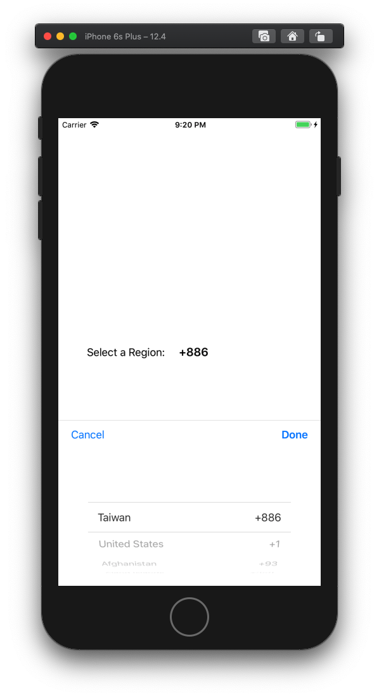
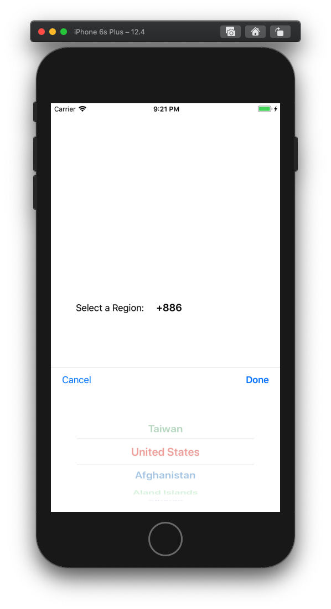

# CCRegionSelector

[](https://travis-ci.org/ChadChang/CCRegionSelector)
[](https://cocoapods.org/pods/CCRegionSelector)
[](https://cocoapods.org/pods/CCRegionSelector)
[](https://cocoapods.org/pods/CCRegionSelector)

| Default | Custom Picker|
|---|---|
|   |   |

## Example

To run the example project, clone the repo, and run `pod install` from the Example directory first.

## Usage

Add the CCRegionSelectorView to your View, then follow `RegionSelectorViewDelegate` protocol

* `showPickInView()` return a view where UIPickerView placed

``` swift
  func showPickInView()->UIView {
    return self.view
  }

```

* `phoneCodeDidChange()` will receive a phone code where user select a region.

``` swift
  func phoneCodeDidChange(phoneCode: String) {
    print(phoneCode)
  }
```

* `customPickerView(_ info: RegionInfo)` retrun a picker view

``` swift
    func customPickerView(_ info: RegionInfo) -> UIView? {
        // return nil if use default picker view
        nil
        // use custom picker view
        // RandomColorRegionPickerView(regionInfo: info)
    }
```

## Optional

* `setDefaultRegion()` to set an initial region.

``` swift
  selectView.setDefaultRegion("TW")
```
* By passing a string array to `setPinRegions()` to mark frequently used.

``` swift
  selectView.setPinRegions(["TW", "CA"])
```
* By passing a string array to `setRestrictRegions()` to show only those regions desired.

``` swift
  selectView.setRestrictRegions(["TW","US","CA"])
```

## Installation

CCRegionSelector is available through [CocoaPods](https://cocoapods.org). To install
it, simply add the following line to your Podfile:

```ruby
pod 'CCRegionSelector'
```

## Author

ChadChang, chadchang.tw at gmail.com

## License

CCRegionSelector is available under the MIT license. See the LICENSE file for more info.

## Attributions

* https://gist.github.com/Goles/3196253